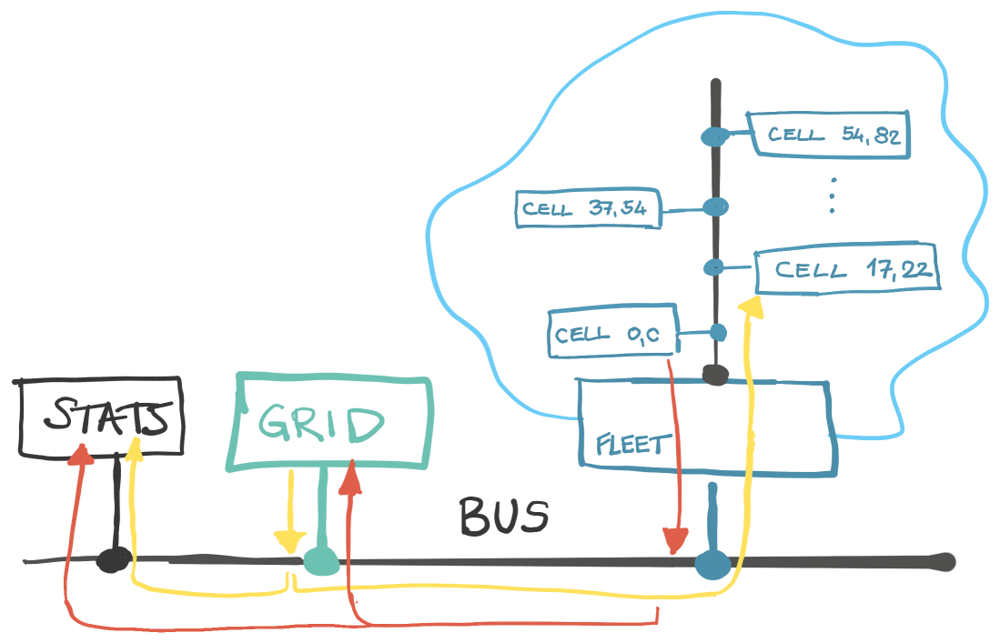

# 🥔 Tatsugō

**Tatsugō** is a lightweight Event-driven engine written in Kotlin, that combines **events**, **queues** and **actors**.

Enables _four million of events per second_ between 10k components (on my M2).

Furthermore, it allows state isolation and writing lock-free code.

## Overview

**Tatsugō** offers a couple of abstractions.

🚌 **Bus** is a simple event bus that broadcasts events to all subscribers.

🎭 **Event handler** is a simple, traditional event processor.
Event Handler process an event and return a list of new events that should be emitted.
This is one distinct feature of **Tatsugō**:
events are never sent directly within the function's code, but provided as the returned value.
Furthermore, there is no guarantee when the events will be processed and in which order regarding the other components.

🧵 **Queue** is a queued event handler.
It filters the events and _queues_ them internally.
The queued events are processed in serial order.
Usually, one queue instance processes all its events.

⚛️ **Particle** is an isolated unit of work; with address, behaviour and, usually, internal (isolated) state.
Particle reminds of actor (and probably _is_ actor:).
Particles communicate via _messages_.
A **message** is an event enhanced with the target particle address.
Particles are never created and run directly.

🚢 **Fleet** is a queue for Particles.
Fleet manages particles: it creates, destroys, and runs them.
All messages are processed in serial order.

## Usage

With **Tatsugō**, you essentially write event-driven code.
However, the idea is to write a code that is easy to reason about,
without using _any_ synchronization code!
The state should be isolated and there is no need for locks.

Essentially, you have three options where to put your code:

1. **Event handler** is a simple event processor.
It should be used only for "global" tasks, like logging, metrics, etc.
There is no guarantee when the event will be processed.
2. **Queue** is usually a singleton that takes care of some global states. It processes events in serial order. The queue code is lock-free!
3. **Particle** represents the behavior around a single state instance. Each particle has a unique address (e.g., a database row id.)
There could (and should) be a _lot_ of particles running at once!
Since they operate only with their own state, they are isolated and lock-free.

Let's go through the example:

**① Start with a Bus**

`Bus` in **Tatsugō** is a simple interface, so you need to choose the implementation. There are two available: one that works with `SharedFlow` and another with `Channel`. The second one is more performant.

Each implementation has its own way of how to start the bus.

```kt
val bus = startChannelBus()
```

**② Add Event Handler (optionally)**

You can use traditional event handlers to process events, but try to avoid them for the business logic.

```kt
bus.subscribe(MyHandler())
```

**③ Add singleton Queues**

Queues should be used for components that maintain some global states.
Think of them as a singleton services that are responsible for e.g., a database table(s).

```kt
val myq = MyQ()
bus.bind(object : Queue {
    override fun isApplicable(event: Event): Boolean =
        event is MyQ.FooEvent
    override fun process(event: Event): Array<Event> =
        myq.on(event as MyQ.FooEvent)
})
```

**④ Create a Fleet and define Particles**

Particles should encapsulate the state and wrap the behaviour around it, same as actors.
Fleet is responsible for managing the particles.

```kt
val fleet = spawnSimpleFleet("bars")
bus.bind(fleet.asQueue())
fleet.bind(BarLifecycle())

// Particle
class Bar(
	val address: ParticleAddress,
	val fleetRef: FleetRef,
	val state: BarState,
	val behavior: (Bar, Msg) -> NextParticle
) : Particle {}
```

## Example: Game of Life

We have the following components:

+ ⚛️ `Cell` is a _particle_ that represents a single cell in the game.
It has a state: alive or dead (and the address, of course.)
Each particle only knows about its own state.
As particles cannot exist on their own, they are created and managed by the Fleet.
+ 🧵 `Grid` is a _queue_ that manages the cells, i.e., the board.
It is a singleton unit that receives information of the cells' state changes.
On each cell change event, `Grid` sends a notification message to all neighbors of the changed cell to its fleet.
+ 🎭 `StatsCounter` - simple event handler that counts the events and prints the statistics at the end of the game, after the last generation.

The example:

+ grid size is `100x100`
+ number of generations is `100`
+ total number of events: `8 900 400` 🔥
+ total execution time is `2.2s` (average) on my machine (M2) 🚀
+ the code is lock-free! No synchronization primitives are used. 🤩


